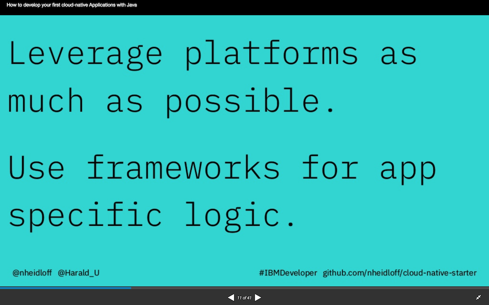

## Cloud Native Starter for Java EE based Microservices on Kubernetes and Istio

This project contains sample code that demonstrates how to get started with cloud-native applications and microservice based architectures. 

The project focusses on how to build microservices with Java EE and the open source technologies [Eclipse MicroProfile](https://microprofile.io/), [Eclipse OpenJ9](https://www.eclipse.org/openj9/), [AdoptOpenJDK](https://adoptopenjdk.net/) and [Open Liberty](https://openliberty.io/).

The microservices can easily be deployed on Kubernetes environments running [Istio](https://istio.io/) like [Minikube](https://kubernetes.io/docs/setup/minikube/), [IBM Cloud Kubernetes Service](https://www.ibm.com/cloud/container-service), [Minishift](https://docs.okd.io/latest/minishift/index.html) or [OpenShift on the IBM Cloud](https://cloud.ibm.com/docs/containers?topic=containers-openshift_tutorial).

The project showcases the following functionality:

* [Containerized Java EE Microservices](documentation/DemoJavaImage.md)
* [Exposing REST APIs](documentation/DemoExposeRESTAPIs.md)
* [Consuming REST APIs](documentation/DemoConsumeRESTAPIs.md)
* [Traffic Routing](documentation/DemoTrafficRouting.md)
* [Resiliency](documentation/DemoResiliency.md)
* [Authentication and Authorization](documentation/DemoAuthentication.md)
* [Metrics](documentation/DemoMetrics.md)
* [Health Checks](documentation/DemoHealthCheck.md)
* [Configuration](documentation/DemoConfiguration.md)
* [Distributed Logging and Monitoring](documentation/DemoDistributedLoggingMonitoring.md)
* [Persistence with Java Persistence API (JPA)](documentation/DemoJPA.md)

This diagram shows the key components:

<kbd></kbd>

The next screenshot shows the web application. More screenshots are in the [images](images) folder.

<kbd></kbd>


### Setup

The sample application can be run in four different environments:

1) **Minikube** (locally): See instructions below
2) **IBM Cloud Kubernetes Service** - see [instructions](documentation/IKSDeployment.md)
3) **Minishift** (locally) - see [instructions](documentation/MinishiftDeployment.md)
4) **OpenShift on the IBM Cloud** - see [instructions](documentation/OpenShiftIKSDeployment.md)

The following instructions describe how to install everything locally on **Minikube**.

Before the microservices can be installed, make sure you've set up Minikube and Istio correctly or follow these [instructions](documentation/SetupLocalEnvironment.md) to set up Minikube and Istio from scratch. This should not take longer than 30 minutes.

Before deploying the application, get the code:

```
$ git clone https://github.com/nheidloff/cloud-native-starter.git
$ cd cloud-native-starter
$ ROOT_FOLDER=$(pwd)
```

The microservices can be installed via scripts. In addition to Minikube and Istio you need the following tools to be available.

Prerequisites:

* [docker](https://docs.docker.com/install/)
* [git](https://git-scm.com/book/en/v2/Getting-Started-Installing-Git)
* [curl](https://curl.haxx.se/download.html)
* [kubectl](https://kubernetes.io/docs/tasks/tools/install-kubectl/)

Docker always needs to be installed locally. The tools git, curl and kubectl (and ibmcloud) can be installed locally or you can use a [Docker image](https://cloud.ibm.com/docs/cli?topic=cloud-cli-using-idt-from-docker) that comes with these tools.

```
$ cd ${ROOT_FOLDER}
$ docker run -v $ROOT_FOLDER/:/cloud-native-starter -it --rm ibmcom/ibm-cloud-developer-tools-amd64
```

Deploy (and redeploy):

```
$ cd ${ROOT_FOLDER}
$ scripts/check-prerequisites.sh
$ scripts/deploy-articles-java-jee.sh
$ scripts/deploy-web-api-java-jee.sh
$ scripts/deploy-authors-nodejs.sh
$ scripts/deploy-web-app-vuejs.sh
$ scripts/deploy-istio-ingress-v1.sh
$ scripts/show-urls.sh
```

After running the scripts above, you will get a list of all URLs in the terminal.

<kbd></kbd>

Example URL to open the web app: http://192.168.99.100:31380

Example API endpoint: http://192.168.99.100:31380/web-api/v1/getmultiple

### Cleanup

Run the following command to delete all cloud-native-starter components from Istio.

```
$ scripts/delete-all.sh
```

You can also delete single components:

```
$ scripts/delete-articles-java-jee.sh
$ scripts/delete-articles-java-jee-quarkus.sh
$ scripts/delete-web-api-java-jee.sh
$ scripts/delete-authors-nodejs.sh
$ scripts/delete-web-app-vuejs.sh
$ scripts/delete-istio-ingress.sh
```

### Authors

* [Niklas Heidloff](https://twitter.com/nheidloff)
* [Harald Uebele](https://twitter.com/harald_u)
* [Thomas Südbröcker](https://twitter.com/tsuedbroecker)


### Documentation - Overview

The following [slides](https://github.com/nheidloff/cloud-native-starter/blob/master/documentation/OneHourTalk.pdf) summarize this repo:

[](documentation/OneHourTalk.pdf)

* [Project Description and Design Principles](http://heidloff.net/article/example-java-app-cloud-kubernetes)
* Presentation at We Are Developers (30 mins): [How to develop your first cloud-native Applications with Java](http://heidloff.net/recording-of-talk-how-to-develop-your-first-cloud-native-applications-with-java/)
* Recording of Jakarta Tech Talk (45 mins): [How to develop your first cloud-native Applications with Java](http://heidloff.net/article/recording-jakarta-tech-talk-how-to-develop-microservices/)
* [Workshop](https://github.com/IBM/cloud-native-starter/tree/master/workshop) (three hours)


### Documentation - Kubernetes and MicroProfile

* [How to build and run a Hello World Java Microservice](http://heidloff.net/article/how-to-build-and-run-a-hello-world-java-microservice/)
* [Dockerizing Java MicroProfile Applications](http://heidloff.net/article/dockerizing-container-java-microprofile)
* [Developing resilient Microservices with Istio and MicroProfile](http://heidloff.net/article/resiliency-microservice-microprofile-java-istio)
* [Managing Microservices Traffic with Istio](https://haralduebele.blog/2019/03/11/managing-microservices-traffic-with-istio/)
* [Web Application to demo Traffic Management with Istio](http://heidloff.net/article/sample-app-manage-microservices-traffic-istio)
* [Implementing and documenting REST APIs with JavaEE](http://heidloff.net/article/rest-apis-microprofile-javaee-jaxrs)
* [Invoking REST APIs from Java Microservices](http://heidloff.net/invoke-rest-apis-java-microprofile-microservice)
* [Prometheus Metrics for MicroProfile Microservices in Istio](http://heidloff.net/article/prometheus-metrics-microprofile-microservices-istio/)
* [Distributed logging with LogDNA and Monitoring with Sysdig](https://haralduebele.blog/2019/04/08/whats-going-on-in-my-cluster/)
* [Implementing Health Checks with MicroProfile and Istio](http://heidloff.net/article/implementing-health-checks-microprofile-istio)
* [Configuring Microservices with MicroProfile and Kubernetes](http://heidloff.net/article/configuring-java-microservices-microprofile-kubernetes/)
* [Authenticating Web Users with OpenID and JWT](http://heidloff.net/article/authenticating-web-users-openid-connect-jwt/)
* [Authorization in Cloud-Native Applications via OpenID and Istio](http://heidloff.net/article/authentication-authorization-openid-connect-istio)
* [Authorization in Microservices with MicroProfile](http://heidloff.net/article/authorization-microservices-java-microprofile/)
* [Persistence for Java Microservices in Kubernetes via JPA](http://heidloff.net/article/persistence-java-microservices-kubernetes-jpa/)
* [Setup of a Local Kubernetes and Istio Dev Environment](http://heidloff.net/article/setup-local-development-kubernetes-istio)
* [Moving from Minikube to IBM Cloud Kubernetes Service](https://haralduebele.blog/2019/04/04/moving-from-minikube-to-ibm-cloud-kubernetes-service/)
* [Recorded demos: Traffic management, resiliency, authorization, logging](http://heidloff.net/article/how-to-develop-your-first-cloud-native-applications-with-java/)
* [Using Quarkus to run Java Apps on Kubernetes](http://heidloff.net/article/quarkus-javaee-microprofile-kubernetes)
* [Debugging Microservices running in Kubernetes](http://heidloff.net/article/debugging-microservices-kubernetes)


### Documentation - OpenShift

* [Setting up a cloud-native Sample App on Minishift in an Hour](http://heidloff.net/article/setup-cloud-native-sample-app-minishift/)
* [Deploying the Cloud Native Starter microservices on Minishift](https://haralduebele.blog/2019/07/03/deploying-the-cloud-native-starter-microservices-on-minishift/)
* [Deploying the Cloud Native Starter example on Red Hat OpenShift on the IBM Cloud](https://haralduebele.blog/2019/07/10/deploying-the-cloud-native-starter-example-on-red-hat-openshift-on-the-ibm-cloud/)
* [Source to Image Builder for Open Liberty Apps on OpenShift](http://heidloff.net/article/source-to-image-builder-open-liberty-openshift/)
* [How to develop Open Liberty Microservices on OpenShift](http://heidloff.net/article/how-to-develop-open-liberty-microservices-openshift/)
* [Deploying Open Liberty Microservices to OpenShift](http://heidloff.net/article/deploying-open-liberty-microservices-openshift/)
* [Accessing private GitLab Repositories from OpenShift](http://heidloff.net/article/accessing-private-gitlab-repositories-from-openshift/)
