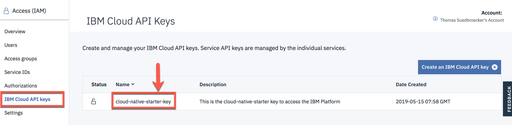
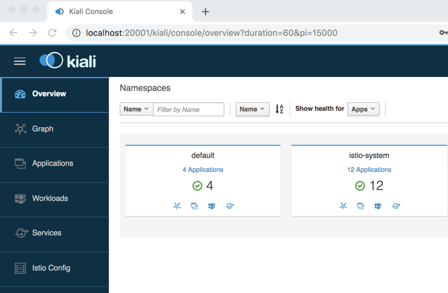
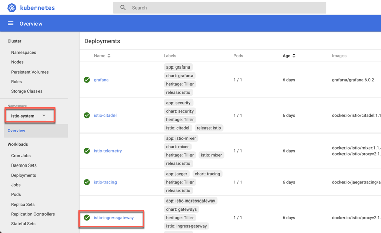
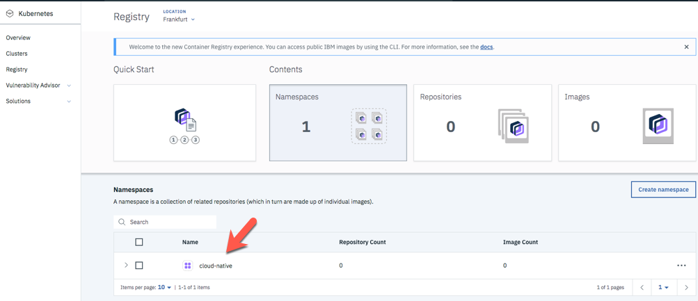

[home](README.md)
# Prerequisites

## 1. IBM Cloud Services

We will use the following IBM Cloud Services in this hands-on workshop:

* [IBM Cloud Kubernetes Service](https://cloud.ibm.com/docs/containers?topic=containers-getting-started#getting-started) with a custom **Istio** installation
* [IBM Cloud Container Registry Service](https://cloud.ibm.com/docs/services/Registry?topic=registry-getting-started#getting-started)

## 3. Verfiy the major prerequisites on your machine

To verfiy the major prerequisites on your machine, you can execute following bash script.

```sh
$ git clone https://github.com/IBM/cloud-native-starter.git
$ cd cloud-native-starter
$ chmod u+x iks-scripts/*.sh
$ chmod u+x scripts/*.sh
$ ./iks-scripts/check-prerequisites.sh
```

## 4. Setup IBM Cloud Kubernetes cluster<a name="home"></a>

By default, deployment is set in Dallas, USA (us-south). 

1. [Register for IBM Cloud](#part-SETUP-00)
2. [Insert promo code](#part-SETUP-01)
3. [Setup the IBM Cloud CLI](#part-SETUP-02)
4. [Get IBM platform key](#part-SETUP-08)
   4.1 [Customize the IBM Cloud Registry name](#part-SETUP-08-1)
5. [Setup the IBM Cloud Kubernetes CLI](#part-SETUP-03)
6. [Create a IBM Cloud Kubernetes Service and add Istio](#part-SETUP-04)
7. [Access the Kubernetes cluster manually (optional)](#part-SETUP-05)
8. [Access the IBM Cloud Container Registry manually (optional)](#part-SETUP-06)

_Note:_ If you already have a lite cluster in Dallas, some of these scripts will not work, because only **one** lite cluster is allowed per account.

---

### 4.4 Get an IBM platform key <a name="part-SETUP-08"></a>

We will need an IBM platform key to use the bash script automation later. 

1. Log in to IBM Cloud using the **"us-south"** Region. Include the --sso option if using a federated ID.

```sh
$ ibmcloud login -a https://cloud.ibm.com -r us-south -g default
```

_Note:_ If this statement does not work, please change **d**efault to **D**efault

2. Create an IBM platform for your API key and name it (**cloud-native-starter-key**, for example) and provide a filename  (**cloud-native-starter-key.json**, for example).

```sh
$ ibmcloud iam api-key-create cloud-native-starter-key \
  -d "This is the cloud-native-starter key to access the IBM Platform" \
  --file cloud-native-starter-key.json
$ cat cloud-native-starter-key.json
```

Sample **json** output. 
Copy the ```"apikey": "KMAdgh4Aw-vhWcqcCsljX26O0dyScfKBaILgxxxxx"```from the json output.

```sh
{
	"name": "cloud-native-starter-key",
	"description": "This is the cloud-native-starter key to access the IBM Platform",
	"apikey": "KMAdgh4Aw-vhWcqcCsljX26O0dyScfKBaILgxxxxx",
	"createdAt": "2019-06-05T06:33+0000",
	"locked": false,
	"uuid": "ApiKey-b96e7355-d1f5-477c-be60-302b20xxxxx"
}
```

_Optional:_ We can verify the key in IBM Cloud, as you can see in the image below:




3. Create a copy of the **template.local.env** and paste the file into the same folder. Rename the new file to **local.env**. Then insert the platform key, which we created before, into the **local.env** file as the value for the ```IBMCLOUD_API_KEY``` variable, which we can see in step 4.

_Note:_ If you use the **custom Docker image**, you don't need to follow these steps.

```sh
$ cp template.local.env local.env
$ cat local.env
```

1. Verify the entries in the `local.env` file.

2. Open file **local.env** in a editor.

_Note:_ If you use the **Docker image**, open the file with the nano editor. ```nano local.env```

We see the file has preset values for regions, cluster name, and image registry namespace in local.env. You can adjust them to your needs.

3. Insert the copied ```"apikey":"KMAdgh4Aw-vhWcqcCsljX26O0dyScfKBaILgxxxxx"```from the json output to ```IBMCLOUD_API_KEY=KMAdgh4Aw-vhWcqcCsljX26O0dyScfKBaILgxxxxx``` and save the file.

### 4.4.1 Customize the IBM Cloud Registry name <a name="part-SETUP-08-1"></a>

1. Edit the `local.env` file.

2. Change the ```REGISTRY_NAMESPACE=cloud-native``` to ```cloud-native-yourname```

_Note:_ `yourname` must be maximum 5 charters. Changing the name is necessary, because namespaces are required to be **unique** across the entire **region** that the **specific registry** is located in, not just ***unique to your account**. This is mentioned in the following [public documentation](https://cloud.ibm.com/docs/services/Registry?topic=registry-getting-started#gs_registry_namespace_add).

**Example** local.env:

```sh
IBMCLOUD_API_KEY=KMAdgh4Aw-vhWcqcCsljX26O0dyScfKBaILgxxxxx
IBM_CLOUD_REGION=us-south
CLUSTER_NAME=cloud-native
REGISTRY_NAMESPACE=cloud-native-yourname
IBM_CLOUD_CF_API=https://api.ng.bluemix.net
IBM_CLOUD_CF_ORG=
IBM_CLOUD_CF_SPACE=dev
AUTHORS_DB=local
CLOUDANT_URL=

```

---

### 4.6  add ISTIO to your Kubernetes Service <a name="part-SETUP-04"></a>
[<home>](#home)

---

* **Adding Istio**

The IBM Kubernetes Service has an option to install a managed Istio mesh into a Kubernetes cluster. Unfortunately, the Lite Kubernetes Cluster we created in the previous step does not meet the hardware requirements for a managed Istio. Hence, we manually install an Istio demo or evaluation version.

These are the instructions to install Istio. For this workshop we are using **Istio 1.1.5**.

_Note:_ Ensure you are logged on to IBM Cloud in your terminal session.
        ```sh
        $ ibmcloud login -a https://cloud.ibm.com -r us-south -g default
        ```
        _Note:_ If this statement does not work, please change **d**efault to **D**efault

1. First, let's check if the cluster is available:

    ```sh
    $ ./iks-scripts/cluster-get-config.sh
    ```
    If the cluster isn't ready, the script will tell you. Just wait a few more minutes and then try again.

    _Note:_ You **must** run this command to check that the cluster completed provisioning, it **must** report that the cluster is **ready for Istio installation**! This command also retrieves the cluster configuration, which is needed in other scripts. This configuration can only be retrieved from clusters in a ready state.

2. List the available clusters: ```ibmcloud ks clusters```. This command should now show the cluster which is being created.


3. Download the configuration file and certificates for the cluster using the ```cluster-config``` command:

    ```sh
    $ ibmcloud ks cluster-config <cluster-name>
    ```

4. Copy and paste the **output** from the command in the previous step to set the `KUBECONFIG` environment variable and configure the CLI to run `kubectl` commands against the cluster:

    ```sh
    $ export KUBECONFIG=/<home>/.bluemix/plugins/container-service/clusters/mycluster/kube-config-<region>-<cluster-name>.yml
    ```


5. Download Istio 1.1.5 directly from github into the **workshop** directory:

    ```sh
    cd workshop
    curl -L https://git.io/getLatestIstio | ISTIO_VERSION=1.1.5 sh -
    ```

    _Note:_ Please be aware that this does **not** work on Windows.
    Windows users can download [istio-1.1.5-win.zip](https://github.com/istio/istio/releases/tag/1.1.5) here.
    Unpack the ZIP file into the workshop directory and add the path to ```istio-1.1.5/bin``` your Windows **PATH**.

6. Add `istioctl` to the PATH environment variable, e.g copy and paste in your shell and/or `~/.profile`:

    ```sh
    export PATH=$PWD/istio-1.1.5/bin:$PATH
    ```

7. Navigate to the extracted directory: 

    ```sh
    cd istio-1.1.5
    ```

8. Install Istio:

    ```sh
    $ for i in install/kubernetes/helm/istio-init/files/crd*yaml; do kubectl apply -f $i; done
    ```
    
    a. Wait a few seconds before issuing the next command:

    ```sh
    $ kubectl apply -f install/kubernetes/istio-demo.yaml
    ```

    b. Check that all pods are **running** or **completed** before continuing.

    ```sh
    $ kubectl get pod -n istio-system
    ```

    c. Enable automatic sidecar injection:

    ```sh
    $ kubectl label namespace default istio-injection=enabled
    ```

    d. Once completed, the Kiali dashboard can be accessed with this command:

    ```sh
    $ kubectl -n istio-system port-forward $(kubectl -n istio-system get pod -l app=kiali -o jsonpath='{.items[0].metadata.name}') 20001:20001
    ```
    e. Then open http://localhost:20001/kiali in your browser, log in with the following credentials Username: admin, Password: admin

    

    In the following image we can see Istio installed on the Kubernetes cluster. We also notice the **Istio Ingress gateway** and the **Istio-System** namespace, which we will use later.
    
    

Customize the IBM Cloud Registry Configure

1. Ensure you are are in the project directory and then execute the script.

```sh
$ cd ../..
$ pwd
$ ./iks-scripts/create-registry.sh
```

Sample output:

```sh
2019-06-05 09:06:40 Creating a Namespace in IBM Cloud Container Registry
2019-06-05 09:06:40 Logging into IBM Cloud
2019-06-05 09:06:48 Creating Namespace cloud-native
2019-06-05 09:07:03 Namespace in IBM Cloud Container Registry created
```

If you get to following output in the ```./iks-scripts/create-registry.log``` logfile ```The requested namespace is already in use```.

```sh
OK
Adding namespace 'cloud-native'...

FAILED
The requested namespace is already in use in registry 'us.icr.io'.
Choose a different namespace.
```

Namespaces are required to be unique across the entire region that the specific registry is located in, not just unique on each account. This is mentioned in the following [public documentation](https://cloud.ibm.com/docs/services/Registry?topic=registry-getting-started#gs_registry_namespace_add). 

Change the registry name in the ```local.env``` file, for example to ```REGISTRY_NAMESPACE=cloud-native-YOUR_NAME```.

```sh
IBM_CLOUD_REGION=us-south
IBM_CLOUD_CLUSTER_REGION=us-south
CLUSTER_NAME=cloud-native
REGISTRY_NAMESPACE=cloud-native-YOUR_NAME
```

_Optional:_ You can find the created namespace here (https://cloud.ibm.com/kubernetes/registry/main/start):



---

Now we have finished all the **preparation**, let's get started with the [introduction](01-introduction.md).
