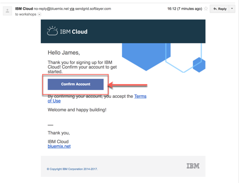
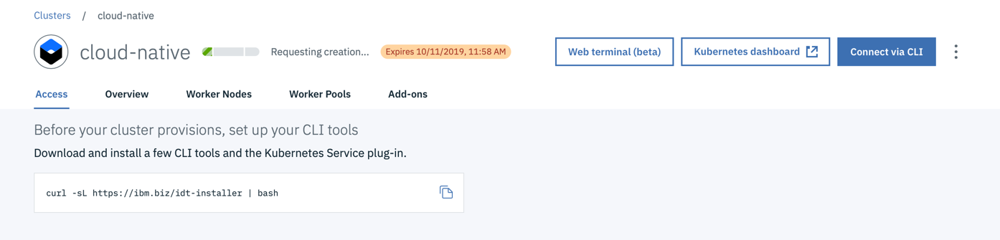

1. [Register for IBM Cloud](#part-SETUP-00)
2. [Insert promo code](#part-SETUP-01)
3. [Create free Kubernetes cluster](#part-SETUP-02)

# 1 Register for IBM Cloud 

## Step 1: Open a browser window and navigate to the IBM Cloud [Registration page](https://ibm.biz/Bd2JHx).

## Step 2: Fill in the registration form and follow the link in the **confirmation email** to confirm your account once it arrives.

## Step 3: [Login into IBM Cloud](https://ibm.biz/Bd2JHx) using your account credentials.

_Note:_ By default, all new IBM Cloud accounts are set to a [lite version](https://www.ibm.com/cloud/pricing).

The lite account provides free access to a subset of IBM Cloud resources. Lite accounts **don't need a credit-card** to sign up and they **don't expire** after a certain period of time. 
In order to create a free Kubernetes cluster, you need a **promo** or **feature code**.

---

# 2 Insert promo code 

In order to execute the workshop easily, we provide **feature codes** to create free Kubernetes clusters, so no credit card details are required.
To apply the feature code to your [Cloud Account](https://cloud.ibm.com/account), navigate to your "`Account settings`" and then to ("`Manage`" -> "`Account`").
Enter your unique Feature (Promo) Code to upgrade your lite account.

_Note:_ Free clusters expire after one month.

---

# 3 Create a free Kubernetes Cluster 

## Step 1: Logon to IBM Cloud

## Step 2: Select in the menu catalog and search for Kubernetes Cluster

## Step 3: Click on the Kubernetes Services and select create

## Step 4: Click on the Kubernetes Services and select create Free

Ensure you set following values in the creation dialog:

* Cluster name:     cloud-native
* Resource group:   Default
* Geography:        North America
* Metro:            Dallas

## Step 5: Press "Create custer"

## Step 6: Now you will be forwarded to you cluster on IBM Cloud and you can verify the status of the creation of you cluster

The creation of the custer takes up to 20 min.

