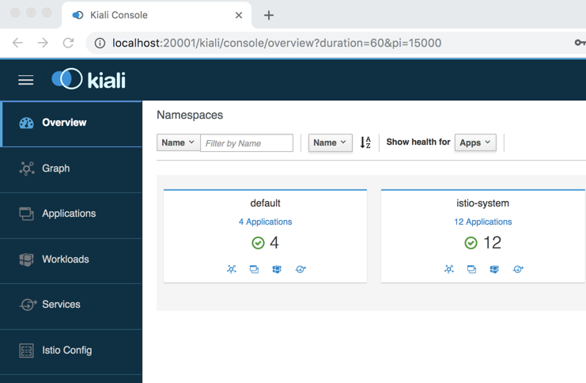
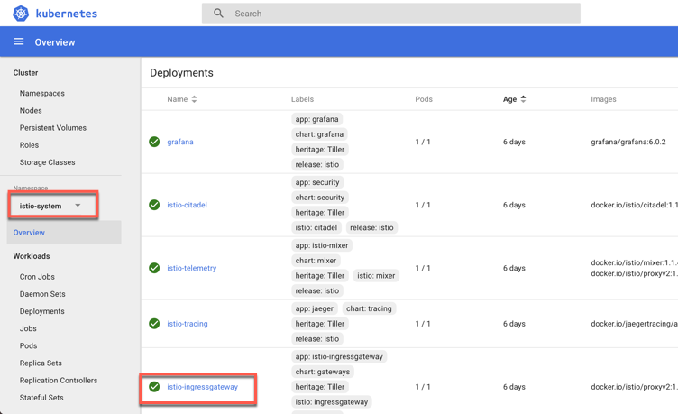
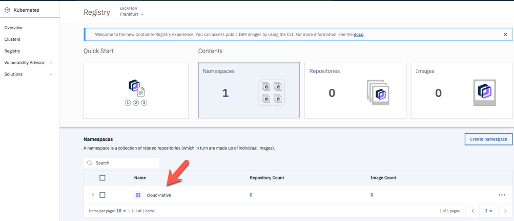

[home](README.md)
# Prerequisites

****** **UNDER CONSTRUCTION** ******

## 1. IBM Cloud Services

We will use the following IBM Cloud Services in this hands-on workshop:

* [IBM Cloud Kubernetes Service](https://cloud.ibm.com/docs/containers?topic=containers-getting-started#getting-started) with a custom **Istio** installation
* [IBM Cloud Container Registry Service](https://cloud.ibm.com/docs/services/Registry?topic=registry-getting-started#getting-started)


## 2. Tools on your laptop

You will need the following tools installed on your laptop, in order to complete the workshop.

- IDE or Editor: [Visual Studio Code](https://code.visualstudio.com/), for example 
- [git](https://git-scm.com/book/en/v2/Getting-Started-Installing-Git) 
- [curl](https://curl.haxx.se/download.html)
- [IBM Cloud CLI](https://cloud.ibm.com/docs/home/tools) 
- [Docker](https://docs.docker.com/v17.12/install/)
- [kubectl](https://kubernetes.io/docs/tasks/tools/install-kubectl/)
- for Windows, you will need access to a Unix shell (Babun, [Cygwin](https://cygwin.com/install.html), etc.)

To verfiy the major prerequisites on your machine, you can execute following bash script on your machine.

```sh
$ git clone https://github.com/nheidloff/cloud-native-starter.git
$ chmod u+x iks-scripts/*.sh
$ ./iks-scripts/check-prerequisites.sh
```

## 3. Setup IBM Cloud Kubernetes cluster<a name="home"></a>

By default, deployment is set in Dallas, USA (us-south). 

1. [Register for IBM Cloud](#part-SETUP-00)
2. [Insert promo code](#part-SETUP-01)
3. [Setup the IBM Cloud CLI](#part-SETUP-02)
4. [Get IBM platform key](#part-SETUP-08)
5. [Setup the IBM Cloud Kubernetes CLI](#part-SETUP-03)
6. [Create a IBM Cloud Kubernetes Service and add Istio](#part-SETUP-04)
7. [Access the Kubernetes cluster manually (optional)](#part-SETUP-05)
8. [Access the IBM Cloud Container Registry manually (optional)](#part-SETUP-06)

_Note:_ If you already have a lite cluster in Dallas, some of these scripts will not work, because only **one** lite cluster is allowed per account.

---

### 3.1 Register for IBM Cloud <a name="part-SETUP-00"></a>

1. Open a browser window and navigate to the IBM Cloud [Registration page](https://ibm.biz/Bd2JHx).


2. Fill in the registration form and follow the link in the **validation email** when it arrives.


3. [Login into IBM Cloud](https://ibm.biz/Bd2JHx) using your account credentials.

_NOTE:_ New IBM Cloud accounts are set by default to the [lite account version](https://www.ibm.com/cloud/pricing).

This account type provides free access to a subset of IBM Cloud resources. Lite accounts **do not need a credit-card** to sign up and they **do not expire** after a set period of time. 
To create a Kubernetes cluster for free, you need a **promo** or **feature code** to get access to create a **Free** Cluster.

---

### 3.2 Insert promo code <a name="part-SETUP-01"></a>
[<home>](#home)

In order to execute the workshop easily, we're providing **promo codes** to create free clusters, so no credit card details are required.
Apply the provided promo code under your [Cloud Account](https://cloud.ibm.com/account) ("`Manage`" -> "`Account`") by navigating to your "`Account settings`".
Apply your personal Feature (Promo) Code there.

_NOTE:_ Free clusters expire after one month.

---

### 3.3 Setup the IBM Cloud CLI <a name="part-SETUP-02"></a>
[<home>](#home)

Follow the steps listed under the [Install from shell](https://cloud.ibm.com/docs/cli/reference/bluemix_cli?topic=cloud-cli-install-ibmcloud-cli#shell_install) section to download and install the IBM Cloud CLI.

- MacOS: `curl -fsSL https://clis.ng.bluemix.net/install/osx | sh`
- Linux: `curl -fsSL https://clis.ng.bluemix.net/install/linux | sh`
- Windows (Powershell): `iex(New-Object Net.WebClient).DownloadString('https://clis.ng.bluemix.net/install/powershell')`

[Documentation install CLI](images/docs.gif)

---

### 3.4 Get an IBM platform key <a name="part-SETUP-08"></a>

To use the bash script automation later we will need an IBM platform key. 

1. Log in to IBM Cloud using the **"us-south"** Region

```sh
ibmcloud login -r us-south
```

2. Create an IBM platform for your API key and name it (example **cloud-native-starter-key**) and provide a filename  (example **cloud-native-starter-key.json**).

```sh
$ ibmcloud iam api-key-create cloud-native-starter-key \
  -d "This is the cloud-native-starter key to access the IBM Platform" \
  --file cloud-native-starter-key.json
$ cat cloud-native-starter-key.json
```

_Optional:_ We can verify the key in IBM Cloud, as you can see in the image below:


3. Create a copy of the **template.local.env** and past the file into the same folder. Rename the new file to **local.env**. Then insert the key we created before, into the **local.env** file as value for the ```IBMCLOUD_API_KEY``` variable, we can see in step 4.

```sh
$ cp template.local.env local.env 
```

4. Verify the entries in the local.env file.

The file local.env has preset values for regions, cluster name, and image registry namespace in local.env. You can adjust them to your needs.

Example local.env:

```sh
IBMCLOUD_API_KEY=AbcD3fg7hIj65klMn9derHHb9zge5
IBM_CLOUD_REGION=us-south
CLUSTER_NAME=cloud-native
REGISTRY_NAMESPACE=cloud-native
IBM_CLOUD_CF_API=https://api.ng.bluemix.net
IBM_CLOUD_CF_ORG=
IBM_CLOUD_CF_SPACE=dev
AUTHORS_DB=local
CLOUDANT_URL=
```
---

### 3.5 Setup the IBM Cloud Kubernetes CLI <a name="part-SETUP-03"></a>
[<home>](#home)

Let's log into the IBM Cloud CLI tool: `ibmcloud login`.
If you are an IBMer, include the `--sso` flag: `ibmcloud login --sso`.

Install the IBM Cloud Kubernetes Service plug-ins:

```sh
$ ibmcloud plugin install container-service
$ ibmcloud plugin install container-registry
```

To verify that the plug-in is installed properly, run `ibmcloud plugin list`.
The Container Service plug-in is displayed in the results as `container-service/kubernetes-service`.

Initialize the Container Service plug-in and point the endpoint to your region with the `ks` sub command:

```sh
$ ibmcloud ks region-set us-south
```

Please note: all subsequent CLI commands will operate in that region.

---

### 3.6 Create a IBM Cloud Kubernetes Service and add ISTIO<a name="part-SETUP-04"></a>
[<home>](#home)

For the following steps we use bash scripts from the github project.

---

#### 3.6.1 Automated creation of a Cluster with Istio for the workshop

* **create cluster**

1. Use the following bash script to create a free Kubernetes Cluster on IBM Cloud:

```sh
$ ./iks-scripts/create-iks-cluster.sh
```

_Note:_ The creation of the cluster can take up to **20 minutes**.
You can verify the cluster in the IBM Cloud, as we see in the image below:


* **add Istio**

The IBM Kubernetes Service has an option to install a managed Istio mesh into a Kubernetes cluster. Unfortunately, the Lite Kubernetes Cluster we created in the previous step does not meet the hardware requirements for a managed Istio. Hence we manually install an Istio demo or evaluation version.

These are the instructions to install Istio. For this workshop we are using **Istio 1.1.5**.

1. First, let's check if the cluster is available:

    ```sh
    $ ./iks-scripts/cluster-add-istio.sh
    ```
    If the cluster isn't ready, the script will tell you. Just wait a few more minutes and then try again.

    _NOTE:_ You **must** run this command to check that the cluster completed provisioning, it **must** report that the cluster is **ready for Istio installation**! This command also retrieves the cluster configuration, which is needed in other scripts. This configuration can only be retrieved from a cluster that is in ready state.

2. Download Istio 1.1.5 directly from github into the **workshop** directory:

    ```sh
    cd workshop
    curl -L https://git.io/getLatestIstio | ISTIO_VERSION=1.1.5 sh -
    ```

    _Note:_ Please be aware that this does **not** work on Windows.
    Windows users can download an istio-1.1.5-win.zip from here: https://github.com/istio/istio/releases/tag/1.1.5
    Unpack the ZIP file into the workshop directory and add the path to ```istio-1.1.5/bin``` your Windows **PATH**.

3. Add `istioctl` to the PATH environment variable, e.g copy and paste in your shell and/or `~/.profile`:

    ```sh
    export PATH=$PWD/istio-1.1.5/bin:$PATH
    ```

4. Navigate to the extracted directory: 

    ```sh
    cd istio-1.1.5
    ```

5. Install Istio:

    ```sh
    $ for i in install/kubernetes/helm/istio-init/files/crd*yaml; do kubectl apply -f $i; done
    ```
    
    a. Wait a few seconds before issuing the next command:

    ```sh
    $ kubectl apply -f install/kubernetes/istio-demo.yaml
    ```

    b. Check that all pods are **running** or **completed** before continuing.

    ```sh
    $ kubectl get pod -n istio-system
    ```

    c. Enable automatic sidecar injection:

    ```sh
    $ kubectl label namespace default istio-injection=enabled
    ```

    d. Once completed, the Kiali dashboard can be accessed with this command:

    ```sh
    $ kubectl -n istio-system port-forward $(kubectl -n istio-system get pod -l app=kiali -o jsonpath='{.items[0].metadata.name}') 20001:20001
    ```
    e. Then open http://localhost:20001/kiali in your browser, log in with Username: admin, Password: admin

    

    In the following image we can see the installed Istio on the Kubernetes cluster. We also notice the **Istio Ingress gateway** and the **Istio-System** namespace, which we will use later.
    
    

* **Configure the IBM Cloud Container Registry**

1. Ensure you are are in the project directory and then execute the script.

```sh
$ cd ../..
$ pwd
$ ./iks-scripts/create-registry.sh
```

_Optional:_ You can find the created namespace here:



---

#### 3.6.2  Manual creation of a Cluster (optional)

You can create an IBM Cloud Kubernetes cluster (lite ) using the [IBM Cloud console](https://cloud.ibm.com/containers-kubernetes/catalog/cluster/create) or using the CLI. A lite / free cluster is sufficient for this workshop.

_NOTE:_ When you're using the CLI or the Cloud console in a browser, always make sure you're **viewing the correct region**, as your resources will only be visible in its region.

---

### 3.7 Accessing the Kubernetes cluster manually (optional) <a name="part-SETUP-05"></a>

Now let's see how to set the context to work with our clusters by using the `kubectl` CLI, how access the Kubernetes dashboard, and how to gather basic information about our cluster.

We set the context for the cluster in the CLI.
Every time you log in to the IBM Cloud Kubernetes Service CLI to work with the cluster, you must run these commands to set the path to the cluster's configuration file as a session variable.
The Kubernetes CLI uses this variable to find a local configuration file and certificates that are necessary to connect with the cluster in IBM Cloud.

List the available clusters: `ibmcloud ks clusters`.
This command should now show the cluster which is being created.

Download the configuration file and certificates for the cluster using the `cluster-config` command:

```sh
$ ibmcloud ks cluster-config <cluster-name>
```

Copy and paste the output command from the previous step to set the `KUBECONFIG` environment variable and configure the CLI to run `kubectl` commands against the cluster:

```sh
$ export KUBECONFIG=/<home>/.bluemix/plugins/container-service/clusters/mycluster/kube-config-<region>-<cluster-name>.yml
```

Get basic information about the cluster and its worker nodes.
This information can help you both manage the cluster and troubleshoot issues.

Get the details of your cluster: `ibmcloud ks cluster-get <cluster-name>`

Verify the nodes in the cluster:

```sh
$ ibmcloud ks workers <cluster-name>
$ kubectl get nodes
```

View the currently available services, deployments, and pods:

```sh
$ kubectl get svc,deploy,po --all-namespaces
```

---

### 3.8 Access the IBM Cloud Container Registry manually (optional) <a name="part-SETUP-06"></a>
[<home>](#home)

In order to build and distribute Container images, we need a Container registry. We can use the **IBM Container Registry** which can be accessed straight from our Kubernetes cluster. Let's log in to the Container Registry service via the `ibmcloud` CLI and obtain the information about our registry:

```sh
$ ibmcloud cr login
$ ibmcloud cr region-set us-south
$ ibmcloud cr region
You are targeting region 'us-south', the registry is 'You are targeting region 'us-south', the registry is 'us.icr.io'.'.
```

---

Now, we've finished all the **preparation**, let's get started with the [introduction](01-introduction.md).
