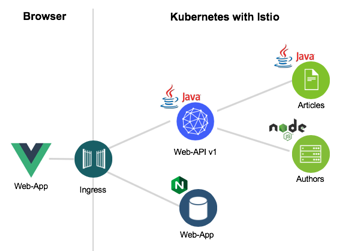

[home](README.md)
# Defining and exposing REST APIs

****** **UNDER CONSTRUCTION** ******

## Making the REST API life easier for Java developer with MicroProfile

MicroProfile comes with a REST Client which defines a type safe client programming model. The REST Client makes it easier to convert between the JSON data and Java objects in both directions.

There is pretty good [documentation](https://github.com/OpenLiberty/guide-microprofile-rest-client) about the REST Client available. In this Lab we describe how we use this client in the **Cloud Native Starter** sample application. The application has a **Web API** service which implements the **BFF** (backend for frontend pattern). The Web API service uses the REST Client to invoke another ‘Authors’ service.



First you need to define the interface of the service you want to invoke. Here we use the [interface AuthorsService](../web-api-java-jee/src/main/java/com/ibm/webapi/data/AuthorsService.java).

```java
import javax.ws.rs.GET;
import javax.ws.rs.Produces;
import javax.ws.rs.core.MediaType;
import com.ibm.webapi.business.Author;
import com.ibm.webapi.business.NonexistentAuthor;
 
@RegisterProvider(ExceptionMapperArticles.class)
public interface AuthorsService {
  @GET
  @Produces(MediaType.APPLICATION_JSON)
  public Author getAuthor(String name) throws NonexistentAuthor; 
}
```

The method **‘getAuthor’** returns an object of the Author class.

```java
public class Author {
   public String name;
   public String twitter;
   public String blog;
}
```

The actual invocation of the authors service happens in [AuthorsServiceDataAccess.java](../web-api-java-jee/src/main/java/com/ibm/webapi/data/AuthorsService.java). The [RestClientBuilder](https://openliberty.io/docs/ref/javadocs/microprofile-1.3-javadoc/org/eclipse/microprofile/rest/client/RestClientBuilder.html) is used to get an implementation of the AuthorsService interface. The deserialization of the data into a Java object is done automatically.

```java
import org.eclipse.microprofile.rest.client.RestClientBuilder;
import com.ibm.webapi.business.Author;
import com.ibm.webapi.business.NonexistentAuthor;
 
public class AuthorsServiceDataAccess {
   static final String BASE_URL = "http://authors/api/v1/";
 
   public AuthorsServiceDataAccess() {} 
 
   public Author getAuthor(String name) throws NoConnectivity, NonexistentAuthor {
      try {
         URL apiUrl = new URL(BASE_URL + "getauthor?name=" + name);
         AuthorsService customRestClient = RestClientBuilder.newBuilder().baseUrl(apiUrl).register(ExceptionMapperAuthors.class).build(AuthorsService.class);
         return customRestClient.getAuthor(name);
      } catch (NonexistentAuthor e) {
         throw new NonexistentAuthor(e);            
      } catch (Exception e) {
         throw new NoConnectivity(e);
      }
   }
}
```

In order to use the RESTClientBuilder you need to understand the concept of the [ResponseExceptionMapper](https://download.eclipse.org/microprofile/microprofile-rest-client-1.0/apidocs/index.html?org/eclipse/microprofile/rest/client/ext/ResponseExceptionMapper.html). This mapper is used to translate certain HTTP response error codes back into Java exceptions.

```java
import org.eclipse.microprofile.rest.client.ext.ResponseExceptionMapper;
import com.ibm.webapi.business.NonexistentAuthor;
 
@Provider
public class ExceptionMapperAuthors implements ResponseExceptionMapper<NonexistentAuthor> {
   @Override
   public boolean handles(int status, MultivaluedMap<String, Object> headers) {
      return status == 204;
   }
   @Override
   public NonexistentAuthor toThrowable(Response response) {
      switch (response.getStatus()) {
         case 204:
            return new NonexistentAuthor();
        }
        return null;
   }   
}
```

Invoke the following commands to set up the demo. Skip the commands you've already executed.

```
$ cd $PROJECT_HOME
$ scripts/check-prerequisites.sh
$ scripts/delete-all.sh
$ scripts/deploy-articles-java-jee.sh
$ scripts/deploy-web-api-java-jee.sh
$ scripts/deploy-istio-ingress-v1.sh
$ scripts/show-urls.sh
```

Invoke the curl command of the 'web-api' microserivce which is displayed as output of 'scripts/show-urls.sh' to get ten articles, for example 'http://192.168.99.100:31380/web-api/v1/getmultiple'.


Read the following resources to learn more about the MicroProfile REST Client.

* [Guide: Consuming RESTful services with template interfaces](https://github.com/OpenLiberty/guide-microprofile-rest-client)
* [Rest Client for MicroProfile](https://github.com/eclipse/microprofile-rest-client)
* [MicroProfile Rest Client in Istio](https://www.eclipse.org/community/eclipse_newsletter/2018/september/MicroProfile_istio.php#restclient)
* [Java Microservices with MicroProfile – Rest Client and JSON-B](https://www.ibm.com/blogs/bluemix/2018/10/migrate-java-microservices-from-spring-to-microprofile-p3/)

[source 'Invoking REST APIs from Java Microservices'](http://heidloff.net/invoke-rest-apis-java-microprofile-microservice)

[source 'Demo: Consume REST APIs'](https://github.com/nheidloff/cloud-native-starter/blob/master/documentation/DemoConsumeRESTAPIs.md)

Now, we've finished the **Defining and exposing REST APIs**.
Let's get started with the [Lab - Using traffic management in Kubernetes](04-traffic-management.md).**