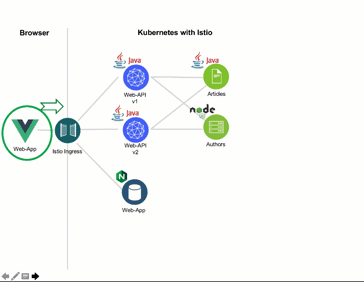

[home](README.md)
# Using traffic management in Kubernetes with Istio

****** **UNDER CONSTRUCTION** ******

The **“Cloud Native Starter”** is a sample polyglot microservices application with Java and Node.js on Kubernetes using Istio for traffic management, tracing, metrics, fault injection, fault tolerance, etc.

There are currently not many Istio examples available, the one most widely used is probably [Istio’s own “Bookinfo”](https://developer.ibm.com/solutions/container-orchestration-and-deployment/?cm_mmc=Search_Google-_-Developer_IBM+Developer-_-WW_EP-_-%2Bistio_b&cm_mmca1=000019RS&cm_mmca2=10004796&cm_mmca7=9041823&cm_mmca8=aud-396679157191:kwd-448983149697&cm_mmca9=_k_EAIaIQobChMIq_ynq8yi4gIVrDLTCh1T2g9AEAAYASAAEgIVAfD_BwE_k_&cm_mmca10=322762525080&cm_mmca11=b&gclid=EAIaIQobChMIq_ynq8yi4gIVrDLTCh1T2g9AEAAYASAAEgIVAfD_BwE) sample or the [Red Hat Istio tutorial](https://github.com/redhat-developer-demos/istio-tutorial). 

These tutorials and examples do focus on the request routing not as a part for a user-facing service behind the Istio ingress.

In this part we create a new instance and version of the web-api microservice.


New we configure the routing to split the usage between our two instances and versions of our web-api microservice.



The interesting part is that there a two versions of Web-API and these exist as two different Kubernetes deployments running in parallel:

[istio-ingress-service-web-api-v1-v2-80-20](Istio/istio-ingress-service-web-api-v1-v2-80-20.yaml)

## Lab - Traffic Routing

In order to demonstrate traffic routing you can run the following commands. 20 % of the web-api API request to read articles will now return 10 instead of 5 articles which is version 2. 80 % of the requests are still showing only 5 articles which is version 1. 

```
$ cd $PROJECT_HOME
$ iks-scripts/check-prerequisites.sh
$ iks-scripts/delete-all.sh
$ iks-scripts/deploy-articles-java-jee.sh
$ iks-scripts/deploy-authors-nodejs.sh
$ iks-scripts/deploy-web-app-vuejs.sh
$ iks-scripts/deploy-web-api-java-jee.sh
$ iks-scripts/deploy-web-api-java-jee-v2.sh
$ iks-scripts/deploy-istio-ingress-v1-v2.sh
$ iks-scripts/show-urls.sh
```

Now, we've finished the **Using traffic management in Kubernetes**.
Let's get started with the [Lab - Resiliency](05-resiliency.md).

---

Resources:

* ['Managing Microservices Traffic with Istio'](https://haralduebele.blog/2019/03/11/managing-microservices-traffic-with-istio/)
* ['Demo: Traffic Routing'](../documentation/DemoTrafficRouting.md)