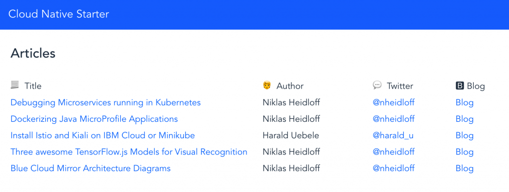
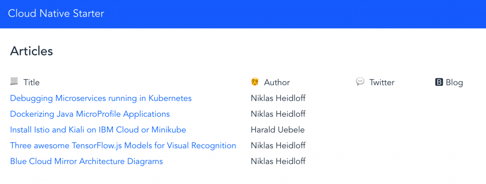
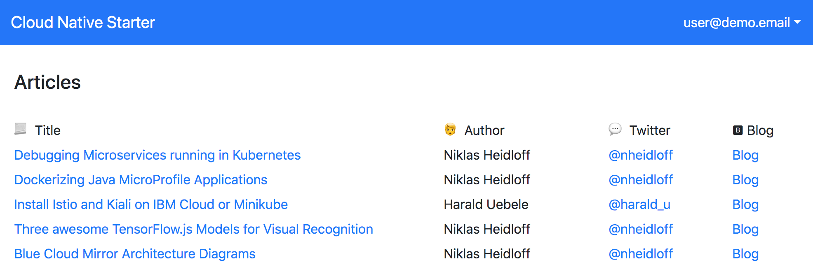

[home](README.md)
# Resiliency

****** **UNDER CONSTRUCTION** ******

As stated in the [reactive manifesto](https://www.reactivemanifesto.org/) cloud-native reactive applications need to be **resilient**:

" **The system stays responsive in the face of failure.** This applies not only to highly-available, mission-critical systems – any system that is not resilient will be unresponsive after a failure. Resilience is achieved by replication, containment, isolation … "

In distributed systems we need to **design for failure**. For example microservices, which invoke other microservices, must be intelligent enough to continue to work even if some of their dependencies are currently not available.

There are several different ways to build resilient service meshes with Istio, for example via [circuit breakers](https://istio.io/docs/concepts/traffic-management/#circuit-breakers) and [retries](https://istio.io/docs/concepts/traffic-management/#timeouts-and-retries).

The Istio functionality for resilient cloud-native applications is generic and independent from the implementation of the microservices. However in some cases the **handling of failures depends on the business logic** of the applications which is why this needs to be implemented in the microservices.

The Web-app frontend implemented in Vue.js displays articles. The service ‘web-api’ implements the **BFF** (backend for frontend) pattern. The web application accesses the ‘web-api’ service which invokes both the ‘articles’ and ‘authors’ services.

The initial page shows the five most recent articles including information about the authors.

When we **delete** the authors service inside Kubernetes, the web-app will still display five articles, but this time without the information about the authors. While the web application cannot display the complete information anymore, in this simple scenario it still makes sense to display the titles and links of the articles. 

| With the author service   |  When the author service is deleted|
| --- | --- |    
|  |  |   

The implementation of this behavior has been done in the class [Service.java](/web-api-java-jee/src/main/java/com/ibm/webapi/business/Service.java#L68).

```java
try {
   Author author = DataAccessManager.getAuthorsDataAccess().getAuthor(coreArticle.author);
   article.authorBlog = author.blog;
   article.authorTwitter = author.twitter;
} catch (NoConnectivity | NonexistentAuthor e) {    
   article.authorBlog = "";
   article.authorTwitter = "";
}
```

If the articles is deleted, we will notice, when we refresh the web application, that the same five articles are still displayed. That’s because in this trivial scenario the ‘web-api’ service **caches** the last read articles. If the ‘articles’ service is not available it simply returns the information from the cache.

|  When the author service is deleted   |   When the author and articles service is deleted |
| --- | --- |    
|  |  | 

We are using the [Eclipse MicroProfile fallback annotation](https://www.openliberty.io/guides/microprofile-fallback.html). In this case a fallback method is invoked if the original method throws an exception. Here we have the two operations inside the [service.java](classweb-api-java-jee/src/main/java/com/ibm/webapi/business/Service.java#L45).

* The definition of the fallback profile **@Fallback**

```java
@Fallback(fallbackMethod = "fallbackNoArticlesService")
public List<Article> getArticles() throws NoDataAccess {
   List<CoreArticle> coreArticles = new ArrayList<CoreArticle>();   
   try {
      coreArticles = DataAccessManager.getArticlesDataAccess().getArticles(5);                          
   } catch (NoConnectivity e) {
      System.err.println("com.ibm.webapi.business.getArticles: Cannot connect to articles service");
      throw new NoDataAccess(e);
   }
...
} 
```
* The implementation of the fallback profile.

```java
...
public List<Article> fallbackNoArticlesService() {
   System.err.println("com.ibm.webapi.business.fallbackNoArticlesService: Cannot connect to articles service");
   if (lastReadArticles == null) lastReadArticles = new ArrayList<Article>();
      return lastReadArticles;
}
```

## Lab - Resiliency

Resiliency is part of the code: if an API call is not answered because of an error ar a timeout, the business logic must have some form of fallback. 

Istio helps to test resiliency by introducing faults into the mesh without changing the application code. 

In order to demonstrate resiliency you can run the following commands to create a working set of services:

```
$ cd $PROJECT_HOME
$ iks-scripts/check-prerequisites.sh
$ iks-scripts/delete-all.sh
$ iks-scripts/deploy-articles-java-jee.sh
$ iks-scripts/deploy-web-api-java-jee.sh
$ iks-scripts/deploy-authors-nodejs.sh
$ iks-scripts/deploy-web-app-vuejs.sh
$ iks-scripts/deploy-istio-ingress-v1.sh
$ iks-scripts/show-urls.sh
```

After this the Web Application shows articles together with the author information:

<kbd></kbd>

The next script disables the Authors service by using Istio Fault Injection:

```
$ kubectl apply -f istio/fault-authors-500.yaml
```

It defines a rule in the Istio virtual service for Authors that responds with an HTTP Error 500 on every request (100 percent).

The articles are still displayed, but without author information. The fallback logic is: if the authors service doesn't work, show no authors information but also don't show an error. 

<kbd></kbd>

The following command disables the articles service, too, again using Istio Fault Injection:

```
$ kubectl apply -f istio/fault-articles-500.yaml
```

Now every request to the articles services gets an HTTP error 500 as response. The same five articles are displayed, since they are cached in the web-api service. This is the fallback logic for the articles service.

<kbd></kbd>

To remove the Istio Fault Injection rules execute these commands:

```
$ kubectl apply -f istio/nofault-authors.yaml
$ kubectl apply -f istio/nofault-articles.yaml
```


Now, we've finished the **Resiliency**.

You have finished this workshop :-).

---

Resources:

* ['Developing resilient Microservices with Istio and MicroProfile'](http://heidloff.net/article/resiliency-microservice-microprofile-java-istio)
* ['MicroProfile, the microservice programming model made for Istio'](https://www.eclipse.org/community/eclipse_newsletter/2018/september/MicroProfile_istio.php)
* ['Demo: Resiliency'](../documentation/DemoResiliency.md)

