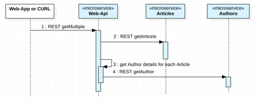
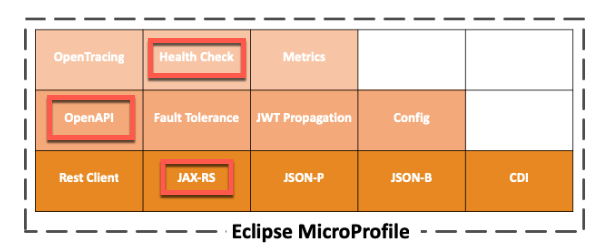

[home](README.md)
# Optional Lab - Replace the Node.JS Authors microservice with a simple Java implementation

****** **UNDER CONSTRUCTION** ******

In that optional Lab we will replace the existing Authors microservices written in Node.JS with a Java implementation, as you can see in the gif below.


As we can see, with a microservice architecture and REST APIs we can easily replace microservice implementation, without any impact to the rest of the **Cloud Native Starter** application.

In that service we only need to implement to provide a **REST API** for a get author request. Normally, we would implement also a database access, but in our case, we will only return sample data information. That sounds not a lot, but with this small sample we touch following topics:

•	Usage of [Maven](https://maven.apache.org/) for Java 

•	Configuration of an [OpenLiberty Server](https://openliberty.io)

•	Implementation of a [REST GET endpoint with MicroProfile](https://openliberty.io/blog/2018/01/31/mpRestClient.html)

•	[Health check](https://openliberty.io/guides/kubernetes-microprofile-health.html#adding-a-health-check-to-the-inventory-microservice) implementation using a MicroProfile for Kubernetes 

•	Definition of a [Dockerfile](https://docs.docker.com/engine/reference/builder/) with the reuse for existing containers from the [Dockerhub](https://hub.docker.com)

•	[Kubernetes deployment configuration](https://kubernetes.io/docs/concepts/workloads/controllers/deployment/)

---

# 1. Usage of Maven for Java

Let’s start with the [Maven](https://maven.apache.org/)
project for our Java project.

> Maven Apache Maven is a software project management and comprehension tool. Based on the concept of a **project object model** (POM), Maven can manage a project's build, reporting and documentation from a central piece of information.

In the **pom** file we define the configuation of our Java project, with **dependencies**, **build** and **properties** including for example the complier information as you can see in the [pom file](authors-java-jee/pom.xml) below.

```xml
<project xmlns="http://maven.apache.org/POM/4.0.0"
	xmlns:xsi="http://www.w3.org/2001/XMLSchema-instance"
	xsi:schemaLocation="http://maven.apache.org/POM/4.0.0 http://maven.apache.org/xsd/maven-4.0.0.xsd">
	<modelVersion>4.0.0</modelVersion>
	<groupId>com.ibm.cloud</groupId>
	<artifactId>authors</artifactId>
	<version>1.0-SNAPSHOT</version>
	<packaging>war</packaging>

	<dependencies>
		<dependency>
			<groupId>javax</groupId>
			<artifactId>javaee-api</artifactId>
			<version>8.0</version>
			<scope>provided</scope>
		</dependency>
		<dependency>
			<groupId>org.eclipse.microprofile</groupId>
			<artifactId>microprofile</artifactId>
			<version>2.1</version>
			<scope>provided</scope>
			<type>pom</type>
		</dependency>
	</dependencies>

	<build>
		<finalName>authors</finalName>
	</build>

	<properties>
		<maven.compiler.source>1.8</maven.compiler.source>
		<maven.compiler.target>1.8</maven.compiler.target>
		<failOnMissingWebXml>false</failOnMissingWebXml>
		<project.build.sourceEncoding>UTF-8</project.build.sourceEncoding>
	</properties>
</project>
```
---

# 2. Configuration the Open Liberty Server

Our **Authors** mircroserice runs later on Open Liberty Server in a container in Kubernetes.

IMAGE

We need to configure the **OpenLiberty** server in the [server.xml](authors-java-jee/liberty/server.xml) file. In our Java implementation we will use the MicroProfile, with the feature definition in the server.xml we define ```webProfile-8.0``` and ```microProfile-2.1``` for our server.
The server must be reached in the network; therefore, we define the  **httpEndpoint** including **http ports** we use for our microservice. For configuration details we can take a look into the [openliberty documentation](https://openliberty.io/docs/ref/config/).

_IMPORTANT to remember_: These **ports** must be exposed later in the **Dockerfile** container definition and mapped inside the **Kubernetes** configurations.

Also the name of the executable **web application** is definied in that **server.xml**.

```xml
<?xml version="1.0" encoding="UTF-8"?>
<server description="OpenLiberty Server">
	
    <featureManager>
        <feature>webProfile-8.0</feature>
        <feature>microProfile-2.1</feature>
    </featureManager>

    <httpEndpoint id="defaultHttpEndpoint" host="*" httpPort="3000" httpsPort="9443"/>

    <webApplication location="authors.war" contextRoot="api"/>

</server>
```

---

# 3. Implementation of the REST GET endpoint with MicroProfile

The sequence diagram below shows a simplified view how the **REST API** is used to get all articles. We will just replace the **Authors** microservice.



## 3.1 MicroProfile basics

In the most of the following classes we will use [MicroProfile](https://openliberty.io/docs/intro/microprofile.html).

> Microservice architecture is a popular approach for building cloud-native applications in which each capability is developed as an independent service. It enables small, autonomous teams to develop, deploy, and scale their respective services independently.

> **Eclipse MicroProfile** is a modular set of technologies designed so that you can write cloud-native Java™ microservices. In this introduction, learn how MicroProfile helps you develop and manage cloud-native microservices. Then, follow the Open Liberty MicroProfile guides to gain hands-on experience with MicroProfile so that you can build microservices with Open Liberty.

In the following image you can see a list of MicroProfiles and the red marked we will use in minimum here.



---

## 3.2 Needed Java classes for the **Authors** service

For the implementation for the **Authors** service we need basicly three classes:

* **AuthorsApplication** class repesents our web application.
* **Author** class repesents the data structure we use for the Author.
* **GetAuthor** class repesents the REST API.


---

### 3.2.1 **Class AuthorsApplication**

Our web application does not implement any business or other logic, it simple needs to run on server with no UI. The AuthorsApplication class extends the [javax.ws.rs.core.Application](https://www.ibm.com/support/knowledgecenter/en/SSEQTP_9.0.0/com.ibm.websphere.base.doc/ae/twbs_jaxrs_configjaxrs11method.html) class to do this. With this extension the ```AuthorsApplication``` class provides access to the classes inside from the ```com.ibm.authors``` package during the runtime. With ```@ApplicationPath``` from MicroProfile we define the base path of the application.

```java
package com.ibm.authors;

import javax.ws.rs.core.Application;
import javax.ws.rs.ApplicationPath;

@ApplicationPath("v1")
public class AuthorsApplication extends Application {
}
```

---

### 3.2.2 **Class Author**

This class simply repesents the data structure we use for the [Author](authors-java-jee/src/main/java/com/ibm/authors/). No MircoProfile is used here.

```java
package com.ibm.authors;

public class Author {

	public String name;
	public String twitter;
    public String blog;

}
```

---

### 3.2.3 **Class GetAuthor**

This class implements the REST API response for our microservice **Authors**. We implement our REST client with the [MicroProfile REST Client](https://github.com/eclipse/microprofile-rest-client/blob/master/README.adoc) in the code we use profiles statements ```@Path```, ```@Get``` from [JAX-RS](https://jcp.org/en/jsr/detail?id=339) and form the [OpenAPI](https://www.openapis.org/) documentation ```@OpenAPIDefinition``` the [MicroProfile OpenAPI](https://github.com/eclipse/microprofile-open-api), which creates automatically a API explorer.

Let's remember the **server.xml** configuration. We added the **MicroProfile** to the server, as you can see in the code below.

```xml
<featureManager>
        <feature>microProfile-2.1</feature>
        ....
</featureManager> 
```

With the combination of the **server.xml** and our usage of **MicroProfile** in the **GetAuthor** class, we can access a **OpenAPI exlporer** with this URL ```http://host:http_port/openapi``` later.

This is the source code of the [GetAuthors class](authors-java-jee/src/main/java/com/ibm/authors/GetAuthor.java) with the used **MicroProfiles**.

```java
@ApplicationScoped
@Path("/getauthor")
@OpenAPIDefinition(info = @Info(title = "Authors Service", version = "1.0", description = "Authors Service APIs", contact = @Contact(url = "https://github.com/nheidloff/cloud-native-starter", name = "Niklas Heidloff"), license = @License(name = "License", url = "https://github.com/nheidloff/cloud-native-starter/blob/master/LICENSE")))
public class GetAuthor {

	@GET
	@APIResponses(value = {
		@APIResponse(
	      responseCode = "404",
	      description = "Author Not Found"
	    ),
	    @APIResponse(
	      responseCode = "200",
	      description = "Author with requested name",
	      content = @Content(
	        mediaType = "application/json",
	        schema = @Schema(implementation = Author.class)
	      )
	    ),
	    @APIResponse(
	      responseCode = "500",
	      description = "Internal service error"  	      
	    )
	})
	@Operation(
		    summary = "Get specific author",
		    description = "Get specific author"
	)
	public Response getAuthor(@Parameter(
            description = "The unique name of the author",
            required = true,
            example = "Niklas Heidloff",
            schema = @Schema(type = SchemaType.STRING))
			@QueryParam("name") String name) {
		
			Author author = new Author();
			author.name = "Niklas Heidloff";
			author.twitter = "https://twitter.com/nheidloff";
			author.blog = "http://heidloff.net";

			return Response.ok(this.createJson(author)).build();
	}

	private JsonObject createJson(Author author) {
		JsonObject output = Json.createObjectBuilder().add("name", author.name).add("twitter", author.twitter)
				.add("blog", author.blog).build();
		return output;
	}
}
```

## 3.3 Supporting live and readiness probes in Kubernetes with HealthCheck

We add the class **HealthEndpoint** into the **Authors** package  as you can see in the following image.


Let's understand what we want to support:

> Kubernetes **provides liveness** and **readiness probes** that are used to check the health of your containers, you will work with readiness probes. These probes can check certain files in your containers, check a TCP socket, or make HTTP requests. **MicroProfile Health** exposes a **health endpoint** on your microservices. Kubernetes polls the endpoint as specified by the probes to react appropriately to any change in the microservice’s status. Read the Adding health reports to microservices guide to learn more about MicroProfile Health.

For more information we can use the [Kubernetes Microprofile Health documentation](https://openliberty.io/guides/kubernetes-microprofile-health.html) and the documentation on [GitHub](https://github.com/eclipse/microprofile-health)

This is the implementation for the Health Check for Kubernetes for the **Authors** service in the [HealthEndpoint class](authors-java-jee/src/main/java/com/ibm/authors/HealthEndpoint.java)

```java
@Health
@ApplicationScoped
public class HealthEndpoint implements HealthCheck {

    @Override
    public HealthCheckResponse call() {
        return HealthCheckResponse.named("authors").withData("authors", "ok").up().build();
    }
}
```

---

# 4. The Dockerfile and the usage of dockerhub

With the [Dockerfile](authors-java-jee/Dockerfile) we define the  how to build a container. For detailed information we use the [Dockerfile documentation](https://docs.docker.com/engine/reference/builder/)

If we build a container, we usually start we an existing container image, which contains a minimum on configuration we need, for example: the OS, the Java version or even more. Therefor we examine [dockerhub](https://hub.docker.com/search?q=maven&type=image&image_filter=official) or we search in the internet, to you the the starting point which fits to our needs. We see **maven** container image on dockerhub the following picture.


Inside the Dockerfile we use **two stages** to build the container image. The reason for the two stages is, we have the objective to be **independed** of local environment settings, when we build our production services. With this concept we don't have to ensure that **Java** and **Maven** (or wrong versions of them) is installed on the local machine of the developers.

In short words one container is only responsible to build the microservice, let us call this container **build environment container** and the other container will contain the microservice, we call this the **production** container.


* **Build environment container**

In the following Dockerfile extract, we can see how we create our **build environment container** based on the maven 3.5 image from the [dockerhub](https://hub.docker.com/_/maven/).

Here we use the **pom** file, we defined before, to build our **Authors service** with ```RUN mvn -f /usr/src/app/pom.xml clean package```.

```dockerfile
FROM maven:3.5-jdk-8 as BUILD
 
COPY src /usr/src/app/src
COPY pom.xml /usr/src/app
RUN mvn -f /usr/src/app/pom.xml clean package
```

* **Production container**

The starting point for the our **Production container** is the [OpenLiberty container](https://hub.docker.com/_/open-liberty).

We copy the **Authors service** code with the **server.xml** to this container. 
_REMEMBER:_ The **service.xml** contains the ports we use for our **Authors service**.

```dockerfile
FROM openliberty/open-liberty:microProfile2-java8-openj9 

COPY liberty/server.xml /config/

COPY --from=BUILD /usr/src/app/target/authors.war /config/apps/
```

## 2. Hands-on tasks - Replace the Node.JS Authors microservice with a simple Java implementation

---

Resources:

* ['Simplest possible Microservice in Java'](../authors-java-jee/README.md)